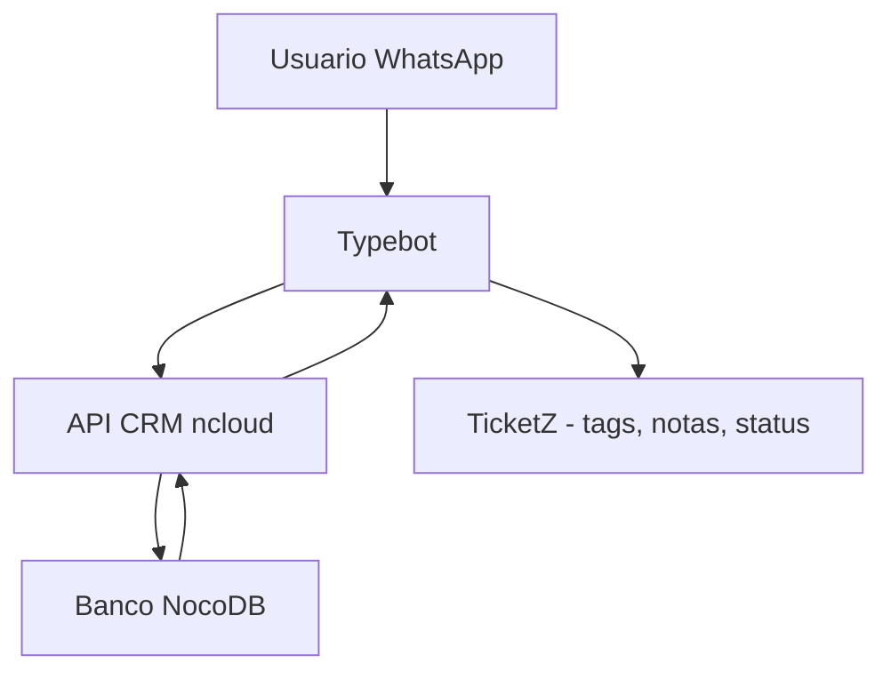
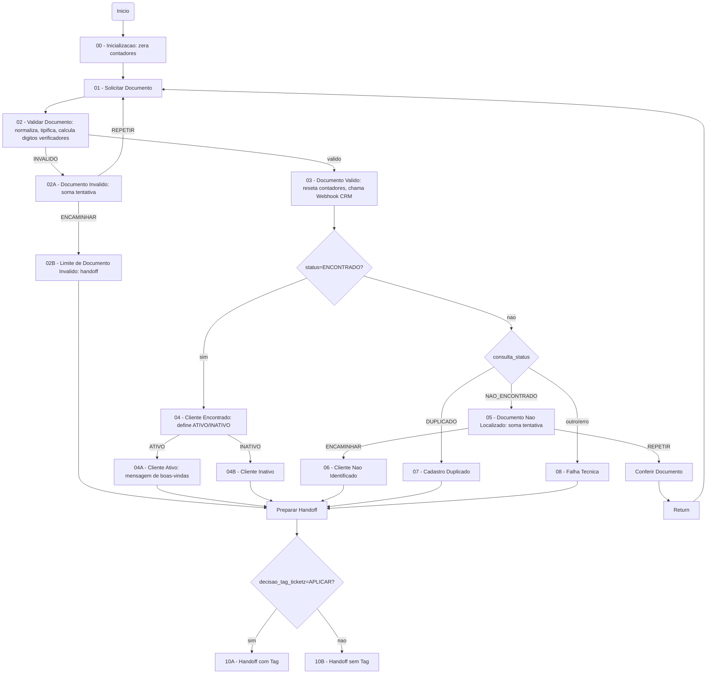
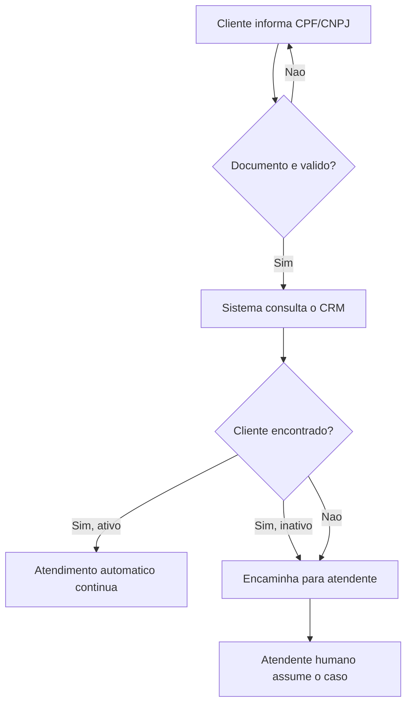
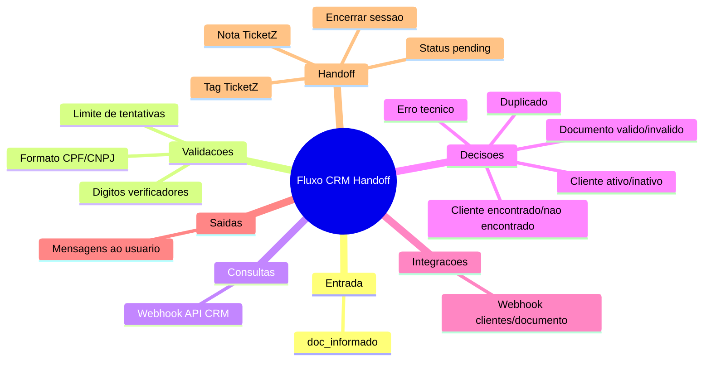
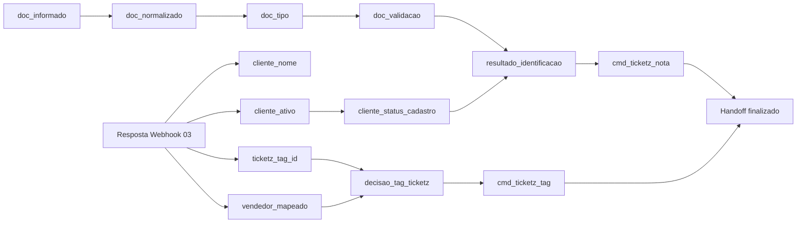
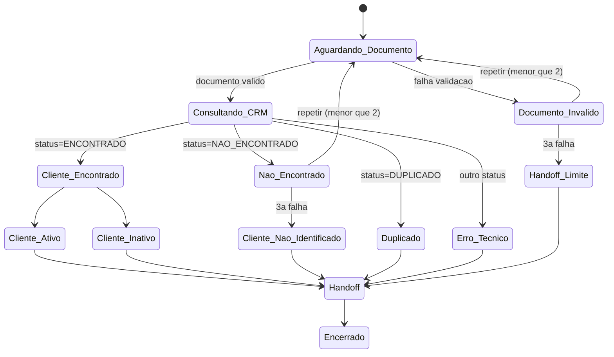

# Documentação Completa do Fluxo Typebot — CRM Homologação NocoDB

## 1. Visão Geral

O fluxo tem como finalidade identificar automaticamente um cliente pelo CPF/CNPJ informado no WhatsApp, consultar seus dados em um CRM (via API REST) 
e decidir o próximo passo do atendimento.

O problema que resolve é evitar que um atendente humano precise perguntar manualmente dados básicos do cliente antes de iniciar o atendimento, automatizando essa etapa inicial.

- **Entrada:** mensagem de texto do cliente contendo CPF ou CNPJ
- **Processamento:** normalização, validação matemática do documento, consulta a uma API externa do CRM e análise da situação cadastral
- **Saída:** mensagem de boas-vindas personalizada (cliente identificado) ou encaminhamento para atendimento humano (handoff) com nota, tag e status "pending" no TicketZ
- **Sistemas envolvidos:** Typebot (motor de conversa), API do CRM (crm-api.ncloud.app.br), TicketZ (ferramenta de tickets/atendimento)

**Resumo executivo:** o robô pede o documento, valida seu formato, busca o cadastro no CRM e, dependendo do resultado (ativo, inativo, não encontrado, duplicado ou erro), 
segue o atendimento automaticamente ou repassa para um humano, deixando uma nota explicativa e aplicando tags quando configurado.

## 2. Arquitetura Geral

O Typebot atua como orquestrador central: recebe a mensagem do usuário, chama a API do CRM (que consulta o NocoDB) e, ao final, envia comandos especiais 
(prefixados por `#`) que o TicketZ interpreta como ações (adicionar tag, nota, mudar status, encerrar sessão).

## 3. Fluxograma Completo

Todos os grupos, decisões e retornos identificados no JSON aparecem no diagrama acima, incluindo os laços de repetição de documento inválido e de cliente não localizado.

## 4. Fluxograma Simplificado

Em poucas palavras: o robô pede o documento, valida, busca o cadastro e só continua sozinho se o cliente existir e estiver ativo; qualquer outra situação vai para um humano.

## 5. Mapa Mental

## 6. Explicação de Cada Grupo

| Grupo | Objetivo | Quando executa | Ação principal | Variáveis alteradas | Decisão / destino |
|---|---|---|---|---|---|
| 00 - Inicialização | Zerar contadores no início da conversa | Ao iniciar o bot | Zera `tentativas_consulta_documento` e `tentativas_documento_invalido` | ambas acima | Segue para "01" |
| 01 - Solicitar Documento | Pedir CPF/CNPJ ao usuário | Início ou após retorno de tentativa | Exibe texto e captura resposta em `doc_informado` | `doc_informado` | Segue para "02" |
| 02 - Validar Documento | Normalizar e validar o documento | Após resposta do usuário | Remove não-dígitos, classifica CPF/CNPJ, calcula dígito verificador | `doc_normalizado`, `doc_tipo`, `doc_validacao` | Se INVALIDO → "02A"; senão → "03" |
| 02A - Documento Inválido | Contar tentativa de erro | Documento reprovado na validação | Incrementa contador, decide repetir ou encaminhar | `tentativas_documento_invalido`, `status_tentativa_documento_invalido` | REPETIR → volta a "01"; ENCAMINHAR → "02B" |
| 02B - Limite de Documento Inválido | Encaminhar após 2 falhas | Terceira tentativa inválida | Define resultado e mensagem final | `resultado_identificacao` | Vai para preparação de handoff |
| 03 - Documento Válido | Consultar CRM | Documento aprovado | Zera contadores, chama Webhook, mapeia resposta, decide sobre tag | Múltiplas (`cliente_nome`, `cliente_ativo`, `consulta_status`, etc.) | Se ENCONTRADO → "04"; senão outra rota |
| 04 - Cliente Encontrado | Verificar status ativo/inativo | Cliente localizado no CRM | Classifica `cliente_status_cadastro` | `cliente_status_cadastro` | ATIVO → "04A"; INATIVO → "04B" |
| 04A - Cliente Ativo | Dar boas-vindas | Cliente ativo | Envia mensagem personalizada | `resultado_identificacao` | Segue para preparar handoff |
| 04B - Cliente Inativo | Informar inatividade | Cliente inativo | Envia aviso | `resultado_identificacao` | Segue para handoff |
| 05 - Documento Não Localizado | Contar tentativa de busca sem sucesso | CRM não encontrou cliente | Incrementa contador, decide repetir/encaminhar | `tentativas_consulta_documento`, `status_tentativa_documento` | REPETIR → "05A"; ENCAMINHAR → "06" |
| 05A - Conferir Documento | Pedir novo documento | Repetição de busca | Mensagem pedindo revisão | — | Return → volta a "01" |
| 06 - Cliente Não Identificado | Registrar falha definitiva | Limite de tentativas atingido | Define resultado e mensagem | `resultado_identificacao` | Handoff |
| 07 - Cadastro Duplicado | Tratar múltiplos cadastros | CRM retorna duplicidade | Define resultado e mensagem | `resultado_identificacao` | Handoff |
| 08 - Falha Técnica na Consulta | Tratar erro de sistema | Erro inesperado da API | Define resultado e mensagem | `resultado_identificacao` | Handoff |
| 09 - Preparar Handoff Humano | Montar comandos para TicketZ | Sempre antes do encerramento | Gera comandos de tag, nota e status pending | `cmd_ticketz_tag`, `cmd_ticketz_nota`, `cmd_ticketz_pendente`, `cmd_ticketz_end_session` | APLICAR → "10A"; senão → "10B" |
| 10A - Handoff com Tag | Executar comandos com tag | Tag configurada | Envia comandos como texto | — | Fim |
| 10B - Handoff sem Tag | Executar comandos sem tag | Tag não aplicável | Envia comandos como texto | — | Fim |

## 7. Explicação de Cada Tipo de Bloco

| Tipo de bloco | Função | Entrada | Saída | Efeito colateral |
|---|---|---|---|---|
| Start | Ponto de entrada da conversa | — | Dispara o primeiro grupo | Nenhum |
| Text | Exibir mensagem ao usuário | Texto fixo/dinâmico | Mensagem na tela do usuário | Nenhum (apenas exibição) |
| Text Input | Capturar resposta do usuário | Digitação do usuário | Valor salvo em variável | Grava variável de sessão |
| Set Variable | Calcular ou definir valor de variável (via expressão JS) | Variáveis existentes | Nova variável atualizada | Pode alterar múltiplas variáveis via código |
| Condition | Tomar decisão com base em comparação de variável | Variável e valor de comparação | Redireciona fluxo para um caminho | Nenhum, apenas desvio |
| Webhook | Chamar API externa (REST) | Corpo/headers definidos | Resposta mapeada para variáveis | Chamada de rede, pode falhar |
| Return | Retornar a um ponto anterior do fluxo | — | Redireciona para bloco/grupo específico | Cria laços de repetição |

## 8. Dicionário de Variáveis

| Nome | Tipo | Origem | Valor inicial | Quem altera | Onde é usada | Quando muda | Exemplo | Descrição simples | Observações |
|---|---|---|---|---|---|---|---|---|---|
| doc_informado | Texto (não sessão) | Entrada do usuário | vazio | Text Input em "01" | "02" | A cada resposta do usuário | "390.533.447-05" | O que o cliente digitou | Não persiste entre sessões |
| doc_normalizado | Sessão | Cálculo em "02" | vazio | "02" | Webhook em "03" | Após cada validação | "39053344705" | Documento só com números | Usado na chamada ao CRM |
| doc_tipo | Sessão | Cálculo em "02" | vazio | "02" | "09" | Após cada validação | "CPF" | Se é CPF ou CNPJ | INVALIDO se não bater tamanho |
| doc_validacao | Sessão | Cálculo em "02" | vazio | "02" | Condição em "02" | Após cada validação | "VALIDO" | Resultado do algoritmo de dígito verificador | Rejeita sequências repetidas |
| tentativas_documento_invalido | Sessão | "00" | 0 | "00", "02A", "03" | "02A" | A cada documento inválido | 1 | Contador de erros de formato | Reseta em "03" |
| status_tentativa_documento_invalido | Sessão | "02A" | vazio | "02A" | Condição em "02A" | A cada tentativa | "REPETIR" | Decide se repete ou encaminha | Limite = 2 |
| resultado_identificacao | Sessão | Vários grupos | vazio | "04A","04B","06","07","08","02B" | "09" | Ao final da jornada | "IDENTIFICADO_ATIVO" | Resumo do resultado do atendimento | Usado na nota do handoff |
| tentativas_consulta_documento | Sessão | "00" | 0 | "00", "05", "03" | "05" | A cada não localização | 1 | Contador de buscas sem sucesso | Reseta em "03" |
| status_tentativa_documento | Sessão | "05" | vazio | "05" | Condição em "Group #9" | A cada tentativa | "ENCAMINHAR" | Decide repetir ou encaminhar | Limite = 2 |
| consulta_status | Sessão | Webhook em "03" | vazio | "03" (resposta API) | Condições em "03","19","20" | Após cada consulta | "ENCONTRADO" | Status retornado pela API do CRM | Pode ser NAO_ENCONTRADO/DUPLICADO/erro |
| cliente_status_cadastro | Sessão | "04" | vazio | "04" | "04A"/"04B" | Após localizar cliente | "ATIVO" | Situação do cadastro | Baseado em cliente_ativo |
| cliente_ativo | Sessão | Resposta da API (`data.cliente.Ativo`) | vazio | Webhook em "03" | "04" | Após consulta | "true" | Se o cliente está ativo no CRM | Texto, não booleano nativo |
| cliente_vendedor | Sessão | API (`data.cliente.Vendedor`) | vazio | Webhook em "03" | "09" | Após consulta | "João Silva" | Vendedor responsável | Usado na nota do handoff |
| cliente_uf | Sessão | API (`data.cliente.UF`) | vazio | Webhook em "03" | "09" | Após consulta | "MG" | Estado do cliente | — |
| cliente_cidade | Sessão | API (`data.cliente.Cidade`) | vazio | Webhook em "03" | "09" | Após consulta | "Viçosa" | Cidade do cliente | — |
| cliente_id | Sessão | API (`data.cliente.id`) | vazio | Webhook em "03" | Não usado explicitamente depois | Após consulta | "12345" | Identificador do cliente no CRM | — |
| cliente_tipo_pessoa | Sessão | API (`data.cliente.TipoPessoa`) | vazio | Webhook em "03" | Não usado explicitamente depois | Após consulta | "Física" | Tipo de pessoa (física/jurídica) | — |
| cliente_nome | Sessão | API (`data.cliente.Nome`) | vazio | Webhook em "03" | "04A","04B","09" | Após consulta | "Maria Souza" | Nome do cliente | Usado nas saudações |
| cliente_encontrado | Sessão | Declarada, não usada em Set Variable visível | vazio | — | — | — | — | Reservada, sem uso explícito nos blocos vistos | Verificar se é usada em outro trecho |
| cliente_status_documento | Sessão | Declarada, sem Set Variable visível | vazio | — | — | — | — | Reservada | Verificar uso completo no arquivo |
| ticketz_tag_id | Sessão | API (`data.cliente.TicketZTagID`) | vazio | Webhook em "03" | "03" (decisão APLICAR/PULAR), "09" | Após consulta | "5" | ID da tag do TicketZ a aplicar | — |
| vendedor_mapeado | Sessão | API (`data.cliente.VendedorMapeado`) | false | Webhook em "03" | "03" (decisão) | Após consulta | "true" | Se o vendedor tem relação mapeada | Texto "true"/"false" |
| vendedor_motivo | Sessão | API (`data.cliente.VendedorMotivo`) | vazio | Webhook em "03" | "09" | Após consulta | "VENDEDOR_INATIVO" | Motivo de não aplicar tag | Traduzido na nota do handoff |
| decisao_tag_ticketz | Sessão | Cálculo em "03" | vazio | "03" | Condição em "09" | Após decisão de tag | "APLICAR" | Se a tag deve ser aplicada | Depende de vendedor_mapeado e ticketz_tag_id |
| cmd_ticketz_tag | Sessão | Cálculo em "09" | vazio | "09" | "10A" (texto) | Ao preparar handoff | '#{"action":"addTag",...}' | Comando de tag para o TicketZ | Prefixo "#" identifica comando |
| cmd_ticketz_nota | Sessão | Cálculo em "09" | vazio | "09" | "10A"/"10B" | Ao preparar handoff | '#{"action":"note",...}' | Comando de nota para o TicketZ | Contém resumo do atendimento |
| cmd_ticketz_pendente | Sessão | Cálculo em "09" | vazio | "09" | "10A"/"10B" | Ao preparar handoff | '#{"action":"updateTicket"...}' | Comando para marcar ticket como pendente | — |
| cmd_ticketz_end_session | Sessão | Cálculo em "09" | vazio | "09" | "10A"/"10B" | Ao preparar handoff | '#{"action":"endSession"}' | Comando para encerrar a sessão do bot | Último passo do fluxo |

## 9. Fluxo das Variáveis

As variáveis nascem quando um bloco "Set Variable" as define ou quando a resposta do webhook as popula; são lidas pelas condições e blocos de texto seguintes, e deixam de ser relevantes após o handoff, quando a sessão é encerrada pelo comando `cmd_ticketz_end_session`.

## 10. Condições

| Condição (grupo) | Variável | Comparação | Verdadeiro | Falso | Impacto |
|---|---|---|---|---|---|
| 02 | doc_validacao | Igual a "INVALIDO" | Vai para "02A" | Vai para "03" | Decide se documento segue ou é rejeitado |
| 02A | status_tentativa_documento_invalido | Igual a "REPETIR" | Volta a pedir documento | Vai para limite ("02B") | Controla número de tentativas (máx. 2) |
| 03 | consulta_status | Igual a "ENCONTRADO" | Vai para "04" | Segue outras rotas (não encontrado, duplicado, erro) | Determina se cliente foi localizado |
| 03 (tag) | decisao_tag_ticketz (calculada) | vendedor_mapeado=true e ticketz_tag_id válido | "APLICAR" | "PULAR" | Define se tag será usada no handoff |
| 04 | cliente_status_cadastro | Igual a "ATIVO" | Vai para "04A" | Vai para "04B" | Define continuidade automática ou handoff |
| Group #9 | status_tentativa_documento | Igual a "REPETIR" | Pede novo documento | Vai para "06" | Controla tentativas de busca (máx. 2) |
| Group #19 | consulta_status | Igual a "NAO_ENCONTRADO" | Vai para "05" | Segue outro caminho | Trata cliente não encontrado |
| Group #20 | consulta_status | Igual a "DUPLICADO" | Vai para "07" | Segue outro caminho | Trata duplicidade |
| 09 | decisao_tag_ticketz (via cmd) | Igual a "APLICAR" | Vai para "10A" | Vai para "10B" | Define versão final do handoff |

## 11. Integrações

O fluxo possui um único Webhook REST, executado no grupo "03 - Documento Válido".

| Campo | Detalhe |
|---|---|
| URL | `https://crm-api.ncloud.app.br/v1/clientes/documento` |
| Método | POST (implícito, com corpo JSON) |
| Headers | `Content-Type: application/json`, `X-CRM-Gateway-Key: TOKEN_SEGREDO_AQUI` |
| Body enviado | `{ "documento": "{{doc_normalizado}}" }` |
| Variáveis enviadas | doc_normalizado |
| Variáveis recebidas (mapeamento) | cliente_nome, cliente_tipo_pessoa, cliente_id, cliente_cidade, cliente_uf, cliente_vendedor, cliente_ativo, consulta_status, ticketz_tag_id, vendedor_mapeado, vendedor_motivo |
| Objetivo | Consultar dados cadastrais do cliente no CRM via documento |
| Possíveis erros | Timeout, token inválido, resposta sem campos esperados (gera erro técnico) |
| Impactos | Toda a jornada seguinte depende do valor de `consulta_status` retornado |

## 12. Mapeamento de APIs

| Campo enviado | Campo recebido | Variável preenchida | Uso no fluxo |
|---|---|---|---|
| documento | data.cliente.Nome | cliente_nome | Mensagens de saudação e nota do handoff |
| documento | data.cliente.TipoPessoa | cliente_tipo_pessoa | Reservado (sem uso posterior visível) |
| documento | data.cliente.id | cliente_id | Reservado (sem uso posterior visível) |
| documento | data.cliente.Cidade | cliente_cidade | Nota do handoff |
| documento | data.cliente.UF | cliente_uf | Nota do handoff |
| documento | data.cliente.Vendedor | cliente_vendedor | Nota do handoff |
| documento | data.cliente.Ativo | cliente_ativo | Decisão ativo/inativo |
| documento | data.status | consulta_status | Decisão de rota principal |
| documento | data.cliente.TicketZTagID | ticketz_tag_id | Decisão de aplicar tag |
| documento | data.cliente.VendedorMapeado | vendedor_mapeado | Decisão de aplicar tag |
| documento | data.cliente.VendedorMotivo | vendedor_motivo | Nota do handoff (motivo de não aplicar tag) |

## 13. Máquina de Estados

## 14. Caminhos Possíveis

- Início → Documento válido → Cliente encontrado → Ativo → Handoff (com boas-vindas) → Encerrado
- Início → Documento válido → Cliente encontrado → Inativo → Handoff → Encerrado
- Início → Documento válido → Não encontrado (1ª vez) → Nova tentativa → Documento válido → Encontrado... → Encerrado
- Início → Documento válido → Não encontrado (2 vezes) → Cliente não identificado → Handoff → Encerrado
- Início → Documento válido → Duplicado → Handoff → Encerrado
- Início → Documento válido → Erro técnico → Handoff → Encerrado
- Início → Documento inválido (1-2x) → Nova tentativa → Documento válido → (qualquer caminho acima)
- Início → Documento inválido (3x) → Handoff (limite atingido) → Encerrado

## 15. Regras de Negócio

- O documento informado deve ser CPF (11 dígitos) ou CNPJ (14 dígitos), com dígito verificador matematicamente válido.
- Sequências repetidas (ex.: 00000000000) são sempre consideradas inválidas.
- Após 2 tentativas de documento inválido, o atendimento é encaminhado para análise humana.
- Após 2 tentativas de busca sem sucesso no CRM, o atendimento também é encaminhado.
- Somente clientes com cadastro ativo continuam no atendimento automático; inativos vão para handoff.
- A tag do TicketZ só é aplicada se houver vendedor mapeado e um ID de tag válido configurado no CRM.
- Todo encaminhamento humano gera uma nota detalhada, muda o status do ticket para "pending" e encerra a sessão do bot.

## 16. Manual de Manutenção

- **Alterar mensagens:** edite o texto dentro do bloco "Text" do grupo desejado (ex.: "01 - Solicitar Documento").
- **Alterar condições:** edite os valores de comparação dentro dos blocos "Condition" (ex.: mudar "ATIVO" para outro critério).
- **Alterar quantidade de tentativas:** modifique o número "2" nas expressões de "02A" e "05" (`< 2`).
- **Alterar variáveis:** renomeie com cuidado na aba de variáveis do Typebot e ajuste todas as referências `{{nome_variavel}}`.
- **Alterar Webhook:** edite URL, headers ou body no grupo "03", mantendo o mapeamento de resposta coerente.
- **Alterar tags:** ajuste a lógica em "09 - Preparar Handoff Humano" que decide `APLICAR`/`PULAR`.
- **Alterar notas/status:** edite os textos e o valor `status` dentro do JSON do comando em "09".

## 17. Guia de Solução de Problemas

| Problema | Sintomas | Possíveis causas | Como verificar | Como corrigir |
|---|---|---|---|---|
| Cliente nunca é encontrado | consulta_status sempre NAO_ENCONTRADO | Token inválido, URL errada, CRM sem o registro | Testar Webhook manualmente com curl | Corrigir token/URL, confirmar dados no CRM |
| Webhook não responde | Erro técnico constante | API fora do ar, timeout | Checar logs do Typebot e status da API | Verificar disponibilidade do serviço CRM |
| Variável vazia | Mensagens exibem "undefined" ou vazio | Mapeamento de resposta incorreto | Comparar bodyPath com resposta real da API | Corrigir bodyPath no mapeamento do Webhook |
| Tag não aplicada | cmd_ticketz_tag vazio | vendedor_mapeado=false ou tagId inválido | Verificar vendedor_motivo na nota | Corrigir cadastro do vendedor no CRM |
| Documento inválido persistente | Cliente sempre reprovado | Erro no algoritmo de dígito verificador, ou documento realmente errado | Testar valores conhecidos válidos | Revisar expressão JS de validação |
| Duplicidade | Fluxo sempre cai em "07" | CRM com registros duplicados | Consultar base do CRM | Corrigir duplicidade na base |

## 18. Checklist de Alterações

- Alterar mensagem: localizar bloco Text → editar texto → testar preview → publicar.
- Alterar API: localizar grupo "03" → editar Webhook → testar com variável de exemplo → validar mapeamento → publicar.
- Alterar URL: dentro do bloco Webhook → campo url → salvar → testar chamada.
- Alterar variável: aba Variáveis → renomear com cuidado → buscar todas as referências `{{}}` → atualizar → testar.
- Adicionar condição: grupo desejado → novo item em bloco Condition → definir comparação → conectar saída → testar caminho.
- Adicionar tentativa: localizar expressão `< 2` → alterar número → testar limite novo.

## 19. Glossário

- **Webhook:** chamada automática a um sistema externo (API) para buscar ou enviar dados.
- **JSON:** formato de texto usado para armazenar e trocar dados estruturados.
- **Variável:** espaço de memória que guarda um valor durante a conversa.
- **Sessão:** o período de uma conversa entre o cliente e o bot.
- **CRM:** sistema que guarda o cadastro e histórico dos clientes.
- **Tag:** etiqueta usada no TicketZ para categorizar o atendimento.
- **Handoff:** transferência do atendimento do robô para um humano.
- **Return:** bloco que redireciona o fluxo de volta a um ponto anterior.
- **API:** interface que permite sistemas diferentes conversarem entre si.
- **Payload:** o conteúdo de dados enviado em uma requisição.
- **Response:** a resposta recebida de uma API.
- **Mapping (mapeamento):** associação entre um campo da resposta da API e uma variável do Typebot.

## 20. Resumo Executivo

O fluxo automatiza a identificação de clientes por CPF/CNPJ, integrando o Typebot a um CRM externo e ao TicketZ para decidir entre continuidade automática ou handoff humano.

As decisões centrais são: validade do documento, existência e status do cliente no CRM, e elegibilidade para aplicação de tag.

A única integração é o Webhook de consulta por documento, cujo funcionamento correto é crítico para todo o fluxo.

Pontos críticos incluem a dependência de um token de API válido e a qualidade dos dados cadastrais no CRM; como risco, erros no mapeamento de campos podem gerar mensagens incorretas ou tags mal aplicadas.

Recomenda-se, para evoluções futuras, adicionar tratamento de erros mais granular no Webhook e validação adicional de tipos de retorno da API.
